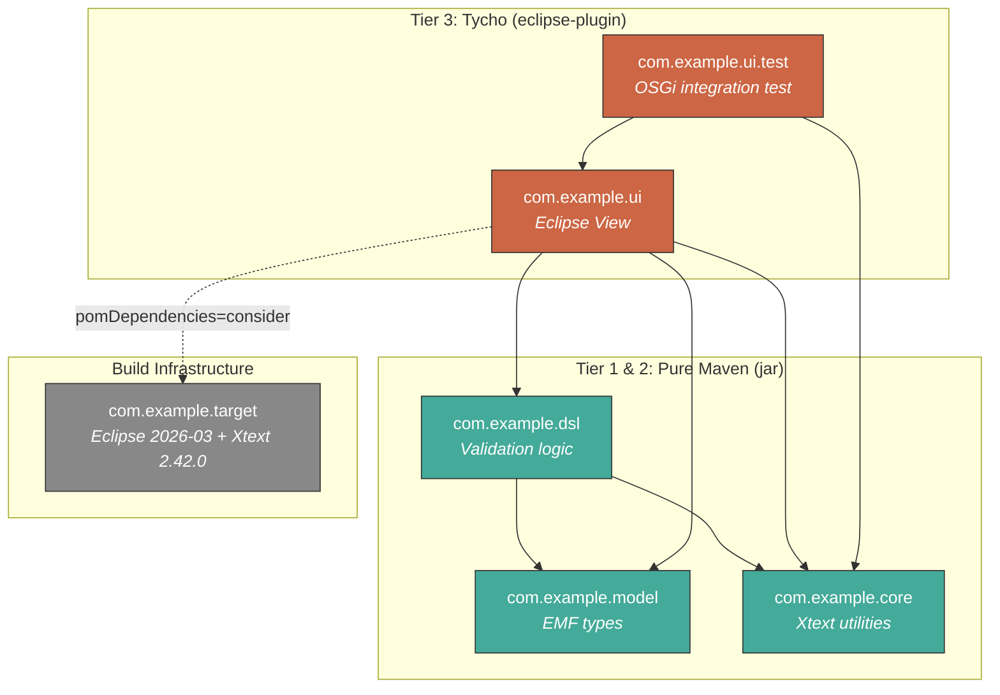

# Eclipse/Maven Split PoC

Proof-of-concept demonstrating that Eclipse/Xtext core plugins can be built as **pure Maven jars** while UI plugins remain on **Tycho**, all in a single reactor.

## Problem

In a typical Eclipse/Tycho project (like [dsl-devkit](https://github.com/dsldevkit/dsl-devkit)), all modules use `eclipse-plugin` packaging. This means:

- Every build resolves a p2 target platform, even for modules with no Eclipse UI dependencies
- Tests run inside an OSGi container even when testing pure logic
- `mvn -pl module -am` doesn't work (MANIFEST.MF dependencies are invisible to Maven)
- No way to use core libraries outside Eclipse or layer modern build tools on top

## Solution: Three-Tier Build

```
Tier 1: mvn -pl :com.example.core          Pure Maven, 1.8s
Tier 2: mvn -P core-only                   All core modules, no Tycho
Tier 3: mvn verify                          Full build, Tycho for UI only
```

Core modules use `jar` packaging with `bnd-maven-plugin` generating OSGi metadata. The resulting JARs are simultaneously standard Maven artifacts and valid OSGi bundles. Tycho UI modules consume them via `pomDependencies=consider`.

## Architecture

### Dependency Graph



### Module Layout

```
eclipse-maven-split/
├── pom.xml                          # Root reactor (profiles: default, core-only)
├── com.example.model/               # PURE MAVEN — EMF model types
├── com.example.core/                # PURE MAVEN — Xtext/EMF utilities
├── com.example.dsl/                 # PURE MAVEN — DSL validation (depends on model + core)
├── com.example.ui/                  # TYCHO — Eclipse view (depends on all core modules)
├── com.example.ui.test/             # TYCHO — OSGi integration test
└── com.example.target/              # Target platform definition
```

## Key Findings

### What works

| Feature | Result |
|---------|--------|
| Xtext 2.42.0 from Maven Central | Resolves, compiles, tests pass |
| EMF 2.42.0 from Maven Central | Resolves, compiles |
| bnd-generated OSGi manifest | Correct Bundle-SymbolicName, Import-Package with version ranges |
| Tycho consuming Maven jar | `pomDependencies=consider` bridges the gap |
| `-am` (also-make) | Works because POM declares dependencies |
| Mixed reactor | `jar` and `eclipse-plugin` modules coexist cleanly |

### Performance

| Command | Time | Tycho? |
|---------|------|--------|
| `mvn verify -pl :com.example.core` | 1.8s | No |
| `mvn verify -pl :com.example.core -am` | 3.2s | No |
| `mvn verify -pl :com.example.ui -am` | 5.5s | Yes |
| `mvn verify` (full, warm) | 3.9s | Yes |
| `mvn verify` (full, cold p2) | 30s | Yes (network) |

### Technical details

- **Tycho 5.0.2** loaded via `tycho-maven-plugin` with `<extensions>true</extensions>` in the root POM. The `.mvn/extensions.xml` approach with `tycho-build` did not register packaging types in Tycho 5.x.
- **`pomDependencies=consider`** (not `wrapAsBundle`). `wrapAsBundle` auto-wraps non-bundles but generates wrong BSNs (prefixed with project groupId), breaking `Require-Bundle` resolution.
- **Xtext runtime in target platform** is required because the core jar's `Import-Package` pulls in `org.eclipse.xtext` which needs `org.antlr.runtime` as a properly named OSGi bundle. Only the Xtext p2 repo provides that.
- **Version mapping**: Maven SNAPSHOT (`1.0.0-SNAPSHOT`) maps to OSGi qualifier (`1.0.0.202604151900`) automatically via bnd.

## How to build

```bash
# Full reactor
mvn clean verify

# Core only (no Tycho)
mvn clean verify -pl :com.example.core

# Core with dependencies
mvn clean verify -pl :com.example.core -am

# UI with all dependencies
mvn clean verify -pl :com.example.ui -am

# Core only via profile
mvn clean verify -P core-only
```

## Applying to dsl-devkit

The dsl-devkit has ~27 core modules (no Eclipse UI deps) and ~14 UI modules. Migration per module:

1. Change `<packaging>eclipse-plugin</packaging>` to `<packaging>jar</packaging>`
2. Convert `MANIFEST.MF` `Require-Bundle` entries to POM `<dependency>` elements
3. Add `bnd-maven-plugin` to generate OSGi manifest from POM deps
4. Remove checked-in `META-INF/MANIFEST.MF` (bnd generates it)
5. Add POM `<dependency>` in any Tycho module that `Require-Bundle`s the migrated module

The Tycho UI modules keep their current structure but gain a `<dependency>` on each core module they use, enabling `pomDependencies=consider` and `-am`.
